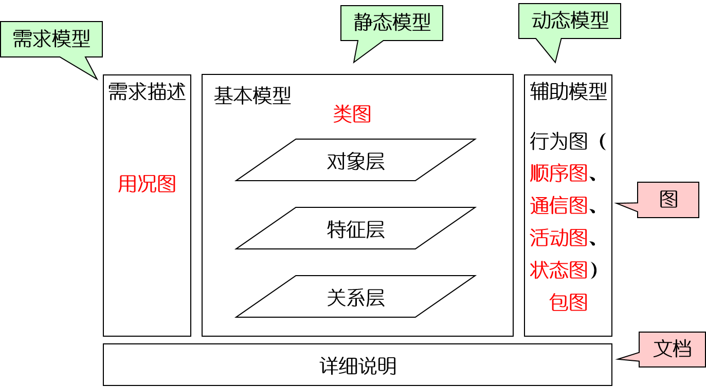

# 面向对象分析

OOA阶段要用面向对象的建模语言对系统要求实现的需求进行建模。

## 问题域和系统责任

- 问题域：被开发系统的应用领域，即在现实世界中这个系统所涉及的业务范围
- 系统责任：被开发系统应具备的职能

## OOA与OOD的区别

- 职责不同：前者要用面向对象的建模语言对系统要实现的需求进行建模；后者则是针对系统的一组具体的实现条件，继续用面向对象建模语言进行系统设计；
- 前者是需求分析阶段，后者是概要设计阶段。

## OOA模型

OOA模型就是通过面向对象的分析所建立的系统分析模型，表达了在OOA阶段所认识到的系统成分及彼此之间的关系。

## OOA过程

