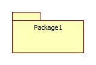

# 建立辅助模型

## 顺序图

- 生命线
- 执行归约
- 消息
  - CALL
  - SEND
  - RETURN
  - CREATE
  - DESTORY
- 结构化控制
  - 用封闭的矩形表示
  - 控制操作符
    - loop:循环控制
    - opt:可选执行
    - par:并行执行
    - alt:条件执行

## 通信图

- 对象
- 连接图
- 消息

## 活动图

- 动作
- 控制流
- 对象流

## 状态机图

- 事件
  - 信号事件
  - 调用事件
  - 时间事件
  - 改变事件
- 状态：初始状态和终止状态都是为状态

- 转移
  - 状态内  
    UML内部的三个触发器：`entry`、`exit`、`do`
  - 状态间

## 包图

- 包的表示法

